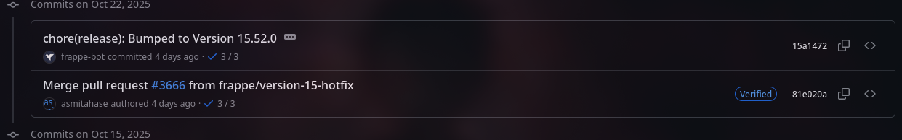

# For Developers

The only files that you need to init change is `apps.json` and `custom.txt`.

## Tree
```
├── .github // No tocar
├── ansible // No tocar
├── apps.json
├── pablo_stock // Custom app 
├── custom.txt // agregar nombre de custom app
├── pyproject.toml 

```

## Configuration Files

### [`apps.json`](apps.json)
Defines the applications to be installed with their repositories and branches.

**Example:**
```json
[
  {
    "url": "https://github.com/frappe/erpnext",
    "branch": "version-15",
    "commit_hash": "7ec6ef3139fbc85e8dc2ddfea97dfa87dc84a95e", <- COMMIT HASH
    "version": "15.84.0" <- VERSION
  },
  {
    "url": "https://github.com/frappe/hrms",
    "branch": "version-15",
    "commit_hash": "15a147224465681bfdddcb33c0017aab623cde54", <- COMMIT HASH
    "version": "15.52.0" <- VERSION
  },
  {
    "url": "https://github.com/deepzide/customer_poc",
    "branch": "main"
  }
]
```

### Cómo saber el commit hash
1. Entrar al repo oficial en GitHub.  
2. En los commits, busca el hash como se muestra en la siguiente imagen:  
   

---

### [`custom.txt`](custom.txt)
ADD custom applications to be installed (one per line).

**Example:**
```
erpnext
<DEV_CUSTOM>
```

**Important:**  
When adding custom development, both configuration files must be updated:  
- Add the repository URL and branch to [`apps.json`](apps.json)  
- Add the application name to [`custom.txt`](custom.txt)
